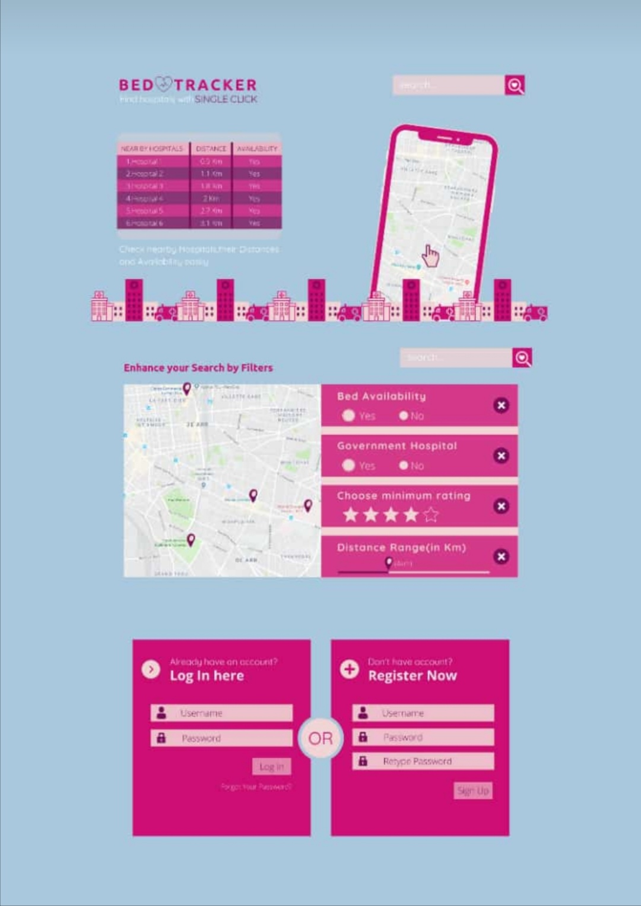

# Bed Tracker
#### Know nearby available hospitals in one click and sort with many filters.
## What it do?
### Don't know about near by hospitals bed vacany, don't worry we are here to help you.
Created a customised web application using Maps to track the nearby hospitals around us which is connected to the hospital's database or data entered manually which will give information about the availability of beds and facilities in that particular hospital.
## Features:
* Filter option according to:
  * Hospital name.
  * Hospital distance from user.
  * User rating.
  * Number of unoccupied beds.
  * Number of total beds.
* User can give rating to hospitals.
* Hospital data can be directly synchronised with hospital database.
* Direct hospital direction link from user location.

## Flow chart

## Expected UI
 
UI contributed by Haresh Prajapati.
## How to run?
    First install PHP/MySqlDevelopment Enviroment: https://www.wa4e.com/install
    Run server
    Open phpmyadmin and make mysql tables sql mentioned in sql.txt file.
    Clone repository in htdocs folder.
    Visit: http://localhost/hospital_bed/main.php
    
If found any bug or any feedback, feel free to contact via email at ritikgarg0035@gmail.com.

